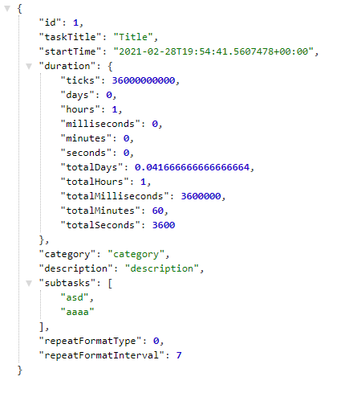

# Orleans and Orleankka in F#

The motivation behind this project was to learn F# language using [Railway Oriented Programming] paradigm combined with [Orleans] and its functional API [Orleankka], which is similar to Akka.

### Solution includes:
- **Domain** - Domain logic for something that potentially could have been something resembling Google Calendar: set up a task, repeat pattern, subtasks and so on. Currently it only performs validation and creation of new Task (not to be confused with ``System.Threading.Tasks.Task``). Interfaces are to be found in ``Domain.PublicTypes.fs`` file.
- **Tests** - Tests for domain logic. 
- **Client** - Orleans client 
- **Contract** - Interfaces for Orleans grains
- **Grain** -  Implementation of grain and interfaces defined in **Contract**
- **Server** - Orleans server
- **WebClient** - Asp .Net Core front application that invokes domain logic.

### How to run this project
Step 1: Run **Server**

Step 2: Run **WebClient**. It will automatically start `localhost:44346/task/getTask1` which runs domain logic. Go to `localhost:44346/task/getTask3` to get exactly the same response, but this time using an Actor model with Orleans/Orleankka. 
In any case, the response should look something like that:

Obviously, because I'm a busy man I will never finish this project. Moreover, is the Actor model really of any use for calendar application? Highly doubtful.

   [Railway Oriented Programming]: <https://fsharpforfunandprofit.com/rop/>
   [Orleans]: <https://github.com/dotnet/orleans>
   [Orleankka]: <https://github.com/OrleansContrib/Orleankka>
   
